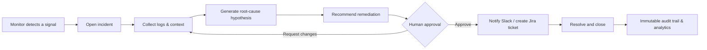
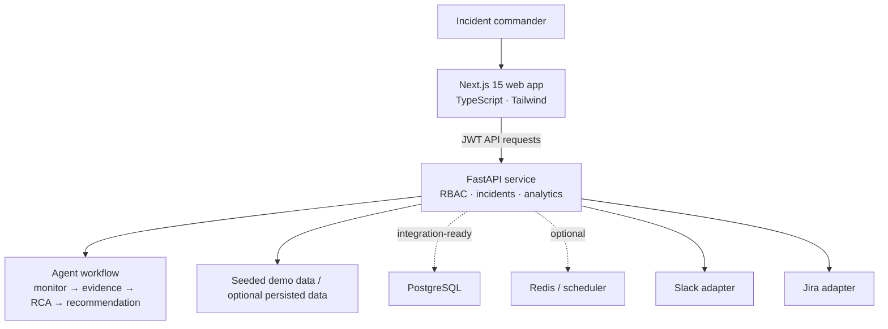

# IncidentOps AI

**A human-governed incident command center for detecting, investigating, approving, and resolving production incidents.**

IncidentOps AI turns the noisy first minutes of an outage into an auditable workflow: it gathers signals, proposes a root cause and next action, and keeps a human accountable for the decision. It is designed as a portfolio-grade demonstration of an AI-assisted operations product—not an autonomous production change engine.

## What it does

- Tracks an incident from **Open** through **Investigating**, **Waiting Approval**, **Resolved**, and **Closed**.
- Presents incident impact, evidence, timeline, owner, severity, and current action in one command center.
- Orchestrates an agent-style investigation flow: monitor signal → log context → root-cause hypothesis → recommendation → human approval → notification/ticket handoff.
- **Real-time Pipeline Tracking:** Uses Server-Sent Events (SSE) to stream agent thoughts, steps, and execution timings directly to the frontend.
- **Production-grade Security:** Secret scanning with Gitleaks in CI, strict constant-time HMAC-SHA256 signature verification for inbound webhooks (PagerDuty, Slack), and a formal `SECURITY.md` policy.
- **Pluggable Output Handlers:** An extensible registry for posting incident resolutions and AI recommendations to external platforms like Slack.
- Enforces role-aware workflows for **Admin**, **Incident Commander**, and **Responder** users with JWT-backed API access.
- Captures operator decisions and lifecycle transitions in an immutable audit trail.
- Surfaces operational analytics and agent health so teams can understand both incidents and the system investigating them.

## Tech Stack

**Frontend:**
- Next.js 15 (App Router)
- TypeScript
- Tailwind CSS
- shadcn/ui
- Recharts (analytics visualization)
- React Flow (agent workflow visualization)

**Backend:**
- FastAPI
- PostgreSQL (via SQLAlchemy & Alembic)
- Redis (optional for background jobs)
- APScheduler (background tasks)
- Pydantic (data validation)
- Pytest (testing)
- Ruff & Black (linting/formatting)

**AI & Agents:**
- Supported LLMs: OpenAI (GPT-4o) and Groq (LLaMA 3.1)
- Tool Calling & Agent logic implemented via direct LLM orchestration (with `pyautogen` available as an extension point).

**DevOps:**
- Docker & Docker Compose
- Nginx (reverse proxy in production)
- GitHub Actions (CI/CD)

## Product flow



## Architecture



The Docker setup brings up PostgreSQL and Redis alongside the application so a production-style data path can be wired in without changing the developer workflow. The current demo backend deliberately ships with seeded data and optional JSON persistence; it does not make unprompted changes in external systems.

## Screenshots to capture

Use these as the recommended portfolio walkthrough sequence after running the app locally. Add the images under `docs/screenshots/` when you publish the project.

| Capture | What it should show |
| --- | --- |
| `01-command-center.png` | Incident list, severity signals, and live status overview. |
| `02-investigation.png` | Evidence timeline, agent reasoning, and root-cause recommendation. |
| `03-human-approval.png` | A remediation awaiting an SRE or Admin decision. |
| `04-analytics.png` | MTTR, incident distribution, and agent health views. |
| `05-audit-trail.png` | Who approved, resolved, or closed an incident and when. |

## Quick start with Docker

### Prerequisites

- Docker Desktop with Compose v2
- A free pair of local ports: `3000` and `8000`

```bash
git clone <your-repository-url>
cd incidentops-ai
cp .env.example .env
docker compose up --build
```

Then open:

| Service | Address |
| --- | --- |
| Web app | <http://localhost:3000> |
| API | <http://localhost:8000> |
| Interactive API docs | <http://localhost:8000/docs> |
| Health check | <http://localhost:8000/health> |

The Compose stack retains PostgreSQL, Redis, and demo data volumes across restarts. To stop it, run `docker compose down`. To reset all local data, run `docker compose down -v`.

> Windows PowerShell users can copy the example file with `Copy-Item .env.example .env` instead of `cp`.

## Local development

Run the API and UI in separate terminals for hot reload.

```bash
# Terminal 1 — API
cd backend
python -m venv .venv
# Windows PowerShell: .\.venv\Scripts\Activate.ps1
# macOS/Linux: source .venv/bin/activate
python -m pip install -r requirements.txt
uvicorn app.main:app --reload --port 8000
```

```bash
# Terminal 2 — web application
cd frontend
npm install
npm run dev
```

For local web development, leave `NEXT_PUBLIC_API_URL` set to `http://localhost:8000`. The app is expected at <http://localhost:3000> and the API at <http://localhost:8000>.

## Demo access

The demo is seeded with safe, fictional incident data.

| User | Password | Intended use |
| --- | --- | --- |
| `maya.chen@incidentops.dev` | `demo123` | `incident_commander` — approves and coordinates response |
| `samir.patel@incidentops.dev` | `demo123` | `responder` — investigates and resolves incidents |
| `lena.ortiz@incidentops.dev` | `demo123` | `admin` — manages the demo environment |

These credentials are deliberately low-security demo defaults. Do not reuse them, expose them, or enable demo mode in a real deployment.

## How to Use It

Once you have the app running locally via Docker or local development, follow these steps to experience the incident lifecycle workflow:

1. **Log in:** Open <http://localhost:3000> and log in as an Incident Commander using `maya.chen@incidentops.dev` (Password: `demo123`).
2. **View the Dashboard:** You will see a list of active and recent incidents in the command center.
3. **Investigate an Incident:** Click on an active incident (e.g., "Checkout payment authorization failures") to view its evidence timeline.
4. **Trigger AI Analysis:** Click the button to trigger the orchestrator pipeline.
5. **Watch the Stream:** The UI will connect to the `/stream` endpoint and display real-time Server-Sent Events (SSE) as the Triage, Correlation, and Runbook agents process the incident.
6. **Review and Approve:** Once the AI agents finish, a recommendation will be proposed. You can review the rationale, risk, and proposed actions, then click **Approve** or **Reject**.
7. **Verify Outputs:** If you configured Slack integration secrets in `.env`, the `OutputHandlerRegistry` will automatically dispatch the approved remediation plan to your configured channels.
8. **Test Webhooks:** You can simulate incoming webhooks by sending HTTP POST requests to `/api/v1/webhooks/pagerduty`. (Make sure to sign your requests with the correct HMAC-SHA256 signature if you have webhook secrets configured!).

## API at a glance

`POST /login` is public. The remaining operational routes expect `Authorization: Bearer <token>`. The service also exposes the API namespace under `/api/v1` for clients that prefer versioned routes.

| Method | Route | Purpose |
| --- | --- | --- |
| `POST` | `/login` | Exchange demo credentials for a JWT. |
| `GET`, `POST` | `/incidents` | List incidents or create a new one. |
| `GET` | `/incidents/{id}` | Read an incident, its evidence, and audit context. |
| `POST` | `/incidents/{id}/analyze` | Trigger the AI orchestrator pipeline. |
| `GET` | `/incidents/{id}/stream` | Stream real-time Server-Sent Events (SSE) from the AI pipeline. |
| `POST` | `/incidents/{id}/approve` | Record a human approval for a recommendation. |
| `POST` | `/incidents/{id}/resolve` | Resolve an incident and append the relevant audit event. |
| `GET` | `/analytics` | Retrieve portfolio-level incident metrics. |
| `GET` | `/agents/status` | Retrieve workflow-agent availability and health. |
| `POST` | `/webhooks/pagerduty` | Receive PagerDuty V3 webhooks with HMAC-SHA256 signature verification. |
| `POST` | `/slack/test` | Exercise the safe Slack handoff/test adapter. |
| `POST` | `/jira/test` | Exercise the safe Jira handoff/test adapter. |
| `GET` | `/health` | Container and platform health check. |

Example login request:

```bash
curl --request POST http://localhost:8000/login \
  --header "Content-Type: application/json" \
  --data '{"email":"maya.chen@incidentops.dev","password":"demo123"}'
```

Use the token from the response in subsequent requests:

```bash
curl http://localhost:8000/incidents \
  --header "Authorization: Bearer <access-token>"
```

For complete request/response schemas, use the live OpenAPI interface at <http://localhost:8000/docs>.

## Configuration

Copy [`.env.example`](.env.example) to `.env` to override Docker Compose defaults. `.env` is intentionally ignored by Git.

| Variable | Default | Meaning |
| --- | --- | --- |
| `FRONTEND_PORT` / `BACKEND_PORT` | `3000` / `8000` | Host ports exposed by the web app and API. |
| `NEXT_PUBLIC_API_URL` | `http://localhost:8000` | Public API base URL embedded in the Next.js build. |
| `LLM_PROVIDER` | `openai` | Set to `openai` or `groq` to switch between LLM models. |
| `OPENAI_API_KEY` | empty | API key for OpenAI GPT models. |
| `GROQ_API_KEY` | empty | API key for Groq models (LLaMA-3). |
| `APP_ENV` | `development` | Runtime environment label. |
| `DEMO_MODE` | `true` | Keeps the workflow in safe seeded/demo behavior. |
| `JWT_SECRET_KEY` | demo placeholder | Signing secret for API tokens. Replace it outside local development. |
| `ACCESS_TOKEN_EXPIRE_MINUTES` | `480` | JWT lifetime in minutes. |
| `CORS_ORIGINS` | `http://localhost:3000` | Comma-separated allowed browser origins. |
| `INCIDENTOPS_DATA_FILE` | `/app/data/incidentops.json` | Optional persisted location for the seeded demo backend. |
| `POSTGRES_DB`, `POSTGRES_USER`, `POSTGRES_PASSWORD` | local demo values | PostgreSQL container configuration. |
| `SLACK_WEBHOOK_URL`, `SLACK_BOT_TOKEN`, `SLACK_CHANNEL` | empty | Enables an explicit Slack integration configuration. |
| `SLACK_SIGNING_SECRET` | empty | HMAC-SHA256 secret for verifying Slack webhook requests. |
| `JIRA_BASE_URL`, `JIRA_EMAIL`, `JIRA_API_TOKEN`, `JIRA_PROJECT_KEY` | empty | Enables an explicit Jira integration configuration. |
| `PAGERDUTY_WEBHOOK_SECRET` | empty | HMAC-SHA256 secret for verifying inbound PagerDuty V3 webhooks. |

## Repository layout

```text
.
├── frontend/                 # Next.js 15 TypeScript command center
├── backend/                  # FastAPI incident and agent-workflow API
├── .github/workflows/ci.yml  # frontend/backend validation and Docker build
├── .env.example              # safe local configuration template
└── docker-compose.yml        # web, API, PostgreSQL, Redis, persistent volumes
```

## Continuous integration

GitHub Actions checks every pull request to `main` by:

1. Installing, linting, and production-building the Next.js application.
2. Installing and compiling the FastAPI service, then running backend tests when they are present.
3. Validating the Compose file and building the application images.

## Safety and production notes

IncidentOps AI is intentionally human-in-the-loop. Treat agent output as decision support—not an instruction to alter infrastructure without review.

Before deploying beyond a demo environment:

- Set a long, unique `JWT_SECRET_KEY` through a secrets manager.
- Disable `DEMO_MODE`, replace seeded data, and configure a durable production datastore/migrations.
- Use narrowly scoped Slack, Jira, and GitHub credentials; never place them in the repository or client-side variables.
- Restrict `CORS_ORIGINS` to real HTTPS domains and put the services behind TLS, rate limiting, and an authenticated reverse proxy.
- Add centralized logs, audit retention, backups, monitoring, and alerting appropriate to your organization.

## License

This project is intended as a portfolio demonstration. Add a license appropriate to your distribution and usage requirements before publishing or reusing it.
